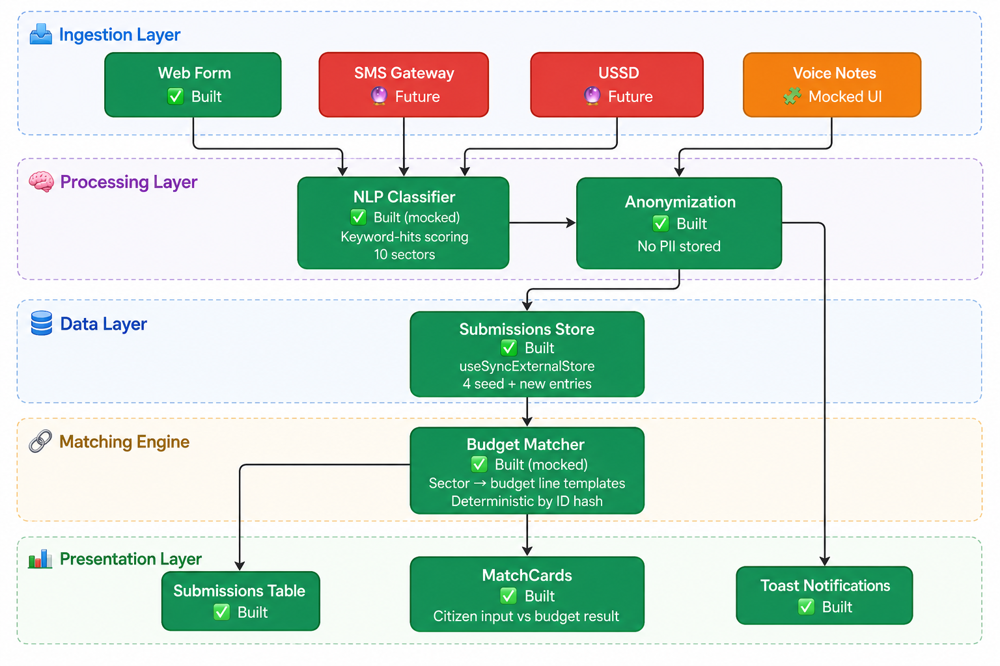

# SautiYetu

> Built during the **Democracy & AI Hackathon** — July 4th, 2026  
> Hosted by **Mozilla Foundation** & **KamiLimu**

---

## Team

| Name | Role | GitHub |
|---|---|---|
| Nancy Wangare | Data Engineer | [@nancywangare](https://github.com/NancyWangareh) |
| Stephen Chacha | Software Engineer | [@stephenchacha](https://github.com/estebanchurchur) |

**Team Name:** SautiYetu &nbsp;|&nbsp; **University:** [Chuka University & Nairobi University]

---

## Problem & User

### Problem Statement

> Kenyan citizens and civil society organizations (CSOs) involved in county budget processes face a profound deficit of accountability, where public input disappears without trace or verifiable impact. This systemic failure is evidenced by the International Budget Partnership's County Budget Transparency Survey 2024, which highlights that local governments consistently fail to provide official feedback on public participation. Despite existing transparency platforms like Open County, which successfully visualize top-down government spending, there remains a critical gap: these tools lack a bottom-up data pipeline to track public feedback against enacted budget lines.

### Target User

| Dimension | Detail |
|---|---|
| **Primary user** | A CSO budget watchdog or community-based organization in Nairobi County monitoring whether citizen proposals are reflected in enacted budgets |
| **Tech comfort** | Comfortable with web dashboards and spreadsheets; may use WhatsApp for field coordination |
| **Language** | Swahili, Sheng, English (Intechangeable) |
| **Current workflow** | Manually compares town hall notes against dense 200+ page county budget PDFs — slow, error-prone, and impossible to scale |

### The Specific Gap

1. **What's already there:** Open County platform (Open Institute / World Bank) digitizes county budgets into visual dashboards; County Budget Transparency Survey publishes annual audit reports.
2. **Why it falls short:** These are top-down tools — they show what the government *says* it spent, but provide no pipeline for ingesting, tracking, or measuring what citizens *actually requested*. Citizen input remains unstructured text scattered across barazas, SMS threads, and web forms with no aggregation.
3. **The gap we fill:** A bottom-up ingestion and classification pipeline that uses keyword-based NLP to auto-categorize unstructured citizen input by sector, then cross-references it against enacted budget lines — producing a visible, contestable verdict for every request: **Matched / Funded**, **Partially Funded**, or **Ignored / Not Funded**.

### Why It Matters

> When CSOs cannot track whether citizen priorities made it into the final budget, public participation becomes a compliance ritual rather than a democratic mechanism. The Open Budget Survey 2023 scores Kenya's public participation at 31/100 — and a shocking 0/100 for post-approval participation during budget implementation and audit. Closing this feedback loop restores the basic accountability contract: citizens speak, government responds, and watchdogs can verify.


## Run Instructions

### Prerequisites

- **Node.js** 18+
- **npm** 9+

### Quick Start

```bash
# 1. Clone the repo
git clone https://github.com/NancyWangareh/SautiYetu-Nancy_Stephen
cd SautiYetu-Nancy_Stephen

# 2. Navigate to frontend
cd src/frontend

# 3. Install dependencies
npm install

# 4. Start the dev server
npm run dev

# 5. Open http://localhost:5173 in your browser 

```

### Project Structure
```bash
.
├── README.md                          ← You are here
├── LICENSE
├── Data/
│   ├── submissions.csv                ← Seed citizen submissions (4 records)
│   ├── budget_lines.csv               ← Enacted budget line templates (14 lines)
│   ├── classification_rules.csv       ← Keyword-to-sector mapping (10 rules)
│   └── wards.csv                      ← Nairobi wards reference data (14 wards)
│
└── src/
    └── frontend/
        ├── index.html
        ├── package.json
        ├── vite.config.js
        ├── eslint.config.js
        └── src/
            ├── main.jsx               ← React entry point
            ├── App.jsx                ← Root component with sidebar nav + routing
            ├── index.css              ← Tailwind CSS v4 import
            ├── assets/                ← Static images & SVGs
            ├── pages/
            │   ├── Input.jsx          ← Citizen ingestion form + NLP preview
            │   ├── Submissions.jsx    ← Trackable submissions table
            │   └── Matches.jsx        ← Budget match cards with status badges
            └── data/
                ├── classify.js        ← NLP classifier (keyword-hits scoring, 10 sectors)
                ├── store.js           ← In-memory store with useSyncExternalStore
                └── matches.js         ← Budget matching engine (sector → budget line templates)

```

### Aproach & Architecture


```bash
Current Content:
[Citizen Input] → [NLP Classifier] → [Submissions Store] → [Budget Matcher] → [MatchCard Verdict]

```
---

## Built vs Mocked

| Component | Status | Notes |
|---|---|---|
| Web form ingestion | ✅ Built | Textarea with placeholder, disabled during processing |
| NLP classification engine | ✅ Built (mocked) | Keyword-hits scoring across 10 sectors × sub-sectors. Stand-in for real ML/NLP |
| Classification confidence display | ✅ Built | Shows sector, subSector, and confidence % in real-time as user types |
| Submissions table | ✅ Built | Columns: ID, Ward, Channel, Request, Sector, Date. Reactive via useSyncExternalStore |
| Budget matching engine | ✅ Built (mocked) | Deterministic sector → budget line mapping by ID hash. Seed records have real pre-set results |
| MatchCard comparison view | ✅ Built | Side-by-side: citizen input (bottom-up) ↔ budget result (top-down) |
| Status badges | ✅ Built | Green (Matched / Funded), amber (Partially Funded), red (Ignored / Not Funded) |
| Toast notifications | ✅ Built | Success toast on submission, auto-dismisses after 3 seconds |
| Sidebar navigation | ✅ Built | Switch-case routing between Input, Submissions, and Budget Matches |
| Voice note button | 🧩 Mocked | UI placeholder with dashed border — no audio capture or speech-to-text backend |
| Photo attachment button | 🧩 Mocked | UI placeholder — no file upload or image processing |
| SMS / USSD channel ingestion | 🔮 Future | Seed data shows SMS, USSD, and Baraza channels exist; only Web Form creates new entries |
| Real county budget data | 🔮 Future | Currently hardcoded budget line templates; future: parse county PDF/CSV exports |
| Speech-to-text processing | 🔮 Future | Voice note button is placeholder for future audio pipeline integration |

### License
MIT © SautiYetu, 2026
